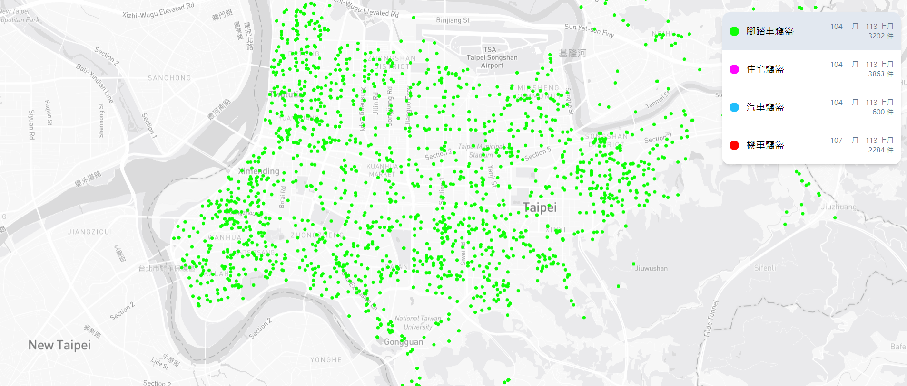

  [Online demo](https://kc0506.github.io/taipei-theft-map/) · [臺北市資料大平台](https://data.taipei/)

# Taipei Theft Map

使用臺北市公開資料製作的簡易地圖，包含以下資料：
- [自行車竊盜點位](https://data.taipei/dataset/detail?id=5c5e9e13-9803-47c0-bbd2-1a4b3c11c49b)
- [住宅竊盜點位](https://data.taipei/dataset/detail?id=68785231-d6c5-47a1-b001-77eec70bec02)
- [汽車竊盜點位](https://data.taipei/dataset/detail?id=f87ad53e-79c7-48c4-aec4-f0fd8f99bfb2)
- [機車竊盜點位](https://data.taipei/dataset/detail?id=3a0e2289-a605-4eac-af30-f4af613f456d)

